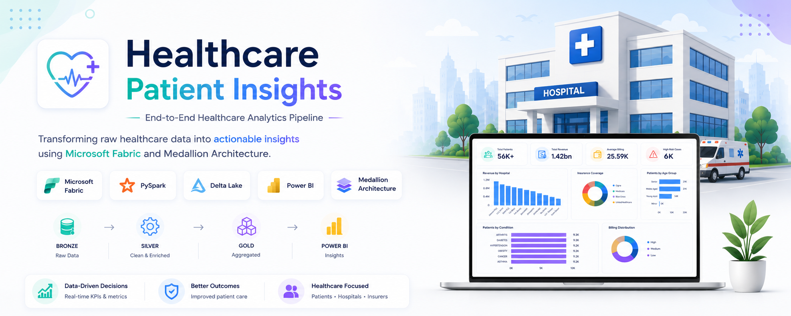
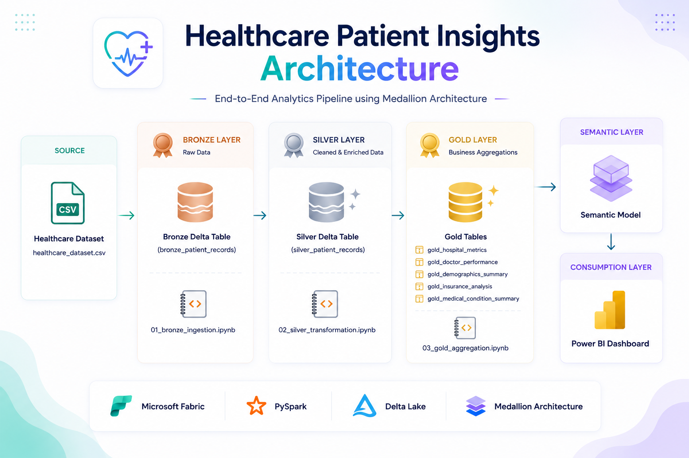
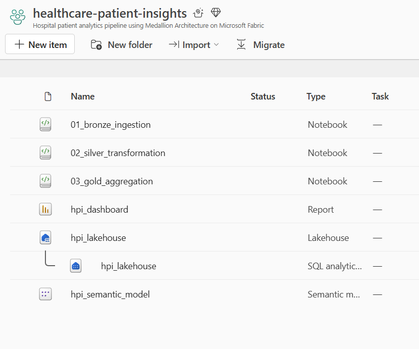

<p align="center">
  
</p>

<h1 align="center">🏥 Healthcare Patient Insights</h1>

<p align="center">
End-to-End Healthcare Analytics Pipeline built using Microsoft Fabric, PySpark, Delta Lake, and Power BI
</p>

<p align="center">


</p>

---

# 📌 Project Overview

Healthcare organizations generate large volumes of patient, billing, insurance, and hospital data every day. This project demonstrates how raw healthcare data can be transformed into business-ready insights using a modern Data Engineering pipeline built on Microsoft Fabric.

The solution follows the **Medallion Architecture (Bronze → Silver → Gold)** and delivers interactive analytics through Power BI dashboards.

---

# 📊 Project Highlights

| Metric | Value |
|----------|----------|
| Records Processed | 55,500+ |
| Bronze Tables | 1 |
| Silver Tables | 1 |
| Gold Tables | 5 |
| Dashboard Visuals | 10+ |
| Total Revenue Analyzed | ₹1.42 Billion |

---

# 🏗️ Solution Architecture

<p align="center">
  
</p>

The project follows a Medallion Architecture approach:

- Bronze Layer → Raw Data Storage
- Silver Layer → Data Cleansing & Feature Engineering
- Gold Layer → Business Aggregations
- Semantic Model → Reporting Layer
- Power BI → Interactive Dashboard

---

# ☁️ Microsoft Fabric Workspace

<p align="center">
  
</p>

The entire solution is implemented within Microsoft Fabric using:

- Lakehouse
- PySpark Notebooks
- Semantic Model
- Power BI Report

---

# 📈 Dashboard Preview

<p align="center">
  
</p>

---

# 🎯 Business Problem

Healthcare institutions need timely insights into:

- Hospital performance
- Revenue generation
- Insurance coverage trends
- Patient demographics
- High-risk patient groups
- Disease distribution

Traditional reporting approaches are often slow and disconnected from operational systems.

This solution centralizes data and provides actionable insights through an analytics-ready architecture.

---

# 🔄 Data Pipeline

## 🥉 Bronze Layer

**Notebook:** `01_bronze_ingestion.ipynb`

Responsibilities:

- Raw CSV ingestion
- Schema preservation
- Delta table creation
- Historical data storage

Output:

```text
bronze_patient_records
```

---

## 🥈 Silver Layer

**Notebook:** `02_silver_transformation.ipynb`

Responsibilities:

- Data cleansing
- Null handling
- Data validation
- Feature engineering

Generated Features:

- Age Group
- Billing Category
- Length of Stay
- Risk Flag
- High Billing Flag

Output:

```text
silver_patient_records
```

---

## 🥇 Gold Layer

**Notebook:** `03_gold_aggregation.ipynb`

Responsibilities:

- Business aggregations
- KPI generation
- Analytics-ready datasets

Gold Tables:

```text
gold_hospital_metrics
gold_doctor_performance
gold_demographics_summary
gold_insurance_analysis
gold_medical_condition_summary
```

---

# 📊 Key Insights Delivered

### Revenue Analysis

- Total Revenue: ₹1.42 Billion
- Top-performing hospitals identified
- Revenue distribution across providers

### Patient Demographics

- Senior and middle-aged patients contribute the largest patient volume
- High-risk cases concentrated within older age groups

### Insurance Analysis

- Coverage distribution analyzed across providers
- Revenue contribution by insurance provider evaluated

### Medical Conditions

Top reported conditions:

- Arthritis
- Diabetes
- Hypertension
- Obesity
- Asthma
- Cancer

---

# 🛠️ Technology Stack

| Category | Technology |
|-----------|------------|
| Cloud Platform | Microsoft Fabric |
| Storage | OneLake |
| Data Processing | PySpark |
| Data Format | Delta Lake |
| Programming Language | Python |
| Analytics | Semantic Model |
| Visualization | Power BI |
| Architecture | Medallion Architecture |

---

# 📂 Repository Structure

```text
healthcare-patient-insights
│
├── notebooks
│   ├── 01_bronze_ingestion.ipynb
│   ├── 02_silver_transformation.ipynb
│   └── 03_gold_aggregation.ipynb
│
├── assets
│   ├── banner.png
│   ├── architecture.png
│   ├── fabric_workspace.png
│   └── hpi_dashboard_overview.png
│
├── PowerBI
│   └── hpi_dashboard.pbix
│
└── README.md
```

---

# 🎯 Key Learnings

Through this project, I gained hands-on experience with:

- Microsoft Fabric Lakehouse
- Medallion Architecture
- Delta Lake
- PySpark Transformations
- Data Quality Validation
- Business Aggregation Design
- Semantic Modeling
- Power BI Dashboard Development

---

# 🚀 Project Outcome

Successfully transformed **55,500+ healthcare records** into analytics-ready datasets and delivered interactive business insights using Microsoft Fabric and Power BI.

The solution demonstrates an end-to-end modern Data Engineering workflow from ingestion to visualization.

---

# 🔮 Future Enhancements

- Real-time healthcare data ingestion
- Incremental loading strategies
- Fabric Data Pipelines
- Automated scheduling
- Predictive analytics using Machine Learning
- Patient risk prediction models

---

# 👨‍💻 Author

**Aman Kumar Singh**

Data Engineering | Cloud | AI/ML

GitHub: https://github.com/aman-krsingh

---

⭐ If you found this project useful, consider giving it a star.
