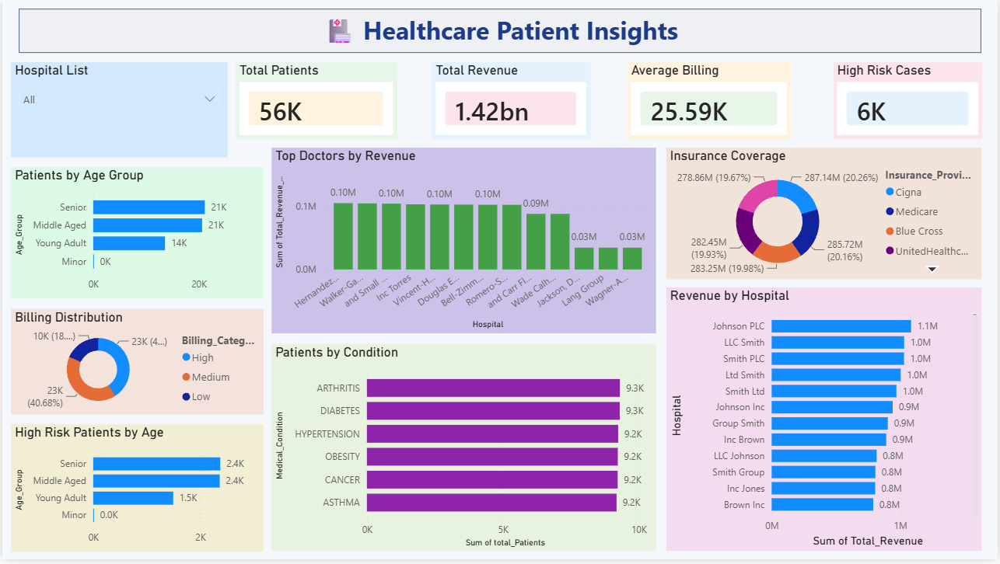

# 🏥 Healthcare Patient Insights

An end-to-end Healthcare Analytics Pipeline built on **Microsoft Fabric** using **Medallion Architecture** (Bronze → Silver → Gold), with a Power BI dashboard showcasing real-world hospital insights.

---

## 📊 Dashboard Preview



---

## 🏗️ Architecture

```
Raw CSV (55,500 rows)
      ↓
 Bronze Layer      → bronze_patient_records (raw Delta table)
      ↓
 Silver Layer      → silver_patient_records (cleaned + 7 engineered features)
      ↓
 Gold Layer        → 5 business-ready aggregation tables
      ↓
 Power BI          → hpi_dashboard (10+ visuals)
```

---

## 🛠️ Tech Stack

| Tool | Usage |
|------|-------|
| Microsoft Fabric | Unified analytics platform |
| Lakehouse (OneLake) | Delta Lake storage |
| PySpark | Data transformation |
| Delta Lake | Versioned table storage |
| Power BI | Dashboard & visualization |
| Python | Notebook scripting |

---

## 📁 Project Structure

```
healthcare-patient-insights/
├── notebooks/
│   ├── 01_bronze_ingestion.ipynb
│   ├── 02_silver_transformation.ipynb
│   └── 03_gold_aggregation.ipynb
├── assets/
│   └── hpi_dashboard_overview.png
├── data/
│   └── sample_data.csv
└── README.md
```

---

## 🔄 Medallion Architecture

### 🥉 Bronze Layer
- Raw CSV ingested into Delta table
- Column names cleaned (spaces removed)
- 55,500 rows, 15 columns

### 🥈 Silver Layer
- Null handling and data type validation
- 7 engineered features added:
  - `Length_of_Stay` — days between admission and discharge
  - `Age_Group` — Minor / Young Adult / Middle Aged / Senior
  - `Billing_Category` — Low / Medium / High
  - `Stay_Category` — Short / Medium / Long Stay
  - `Risk_Flag` — High / Medium / Low Risk
  - `High_Billing_Flag` — boolean for billing > 40K
- 55,500 rows, 22 columns

### 🥇 Gold Layer
| Table | Description |
|-------|-------------|
| `gold_medical_condition_summary` | Avg billing, risk, stay by disease |
| `gold_hospital_metrics` | Revenue, emergency cases by hospital |
| `gold_doctor_performance` | Patient load, revenue per doctor |
| `gold_demographics_summary` | Age group + billing + stay breakdown |
| `gold_insurance_analysis` | Total billed per insurance provider |

---

## 📈 Key Insights

- 💰 **Total Revenue:** 1.42 Billion across all hospitals
- 🏥 **Total Patients:** 55,500
- ⚠️ **High Risk Cases:** 6,000+
- 🩺 **Avg Billing:** ₹25,590 per patient
- 🏆 **Top Hospital:** Johnson PLC by total revenue

---

## 📦 Dataset

- **Source:** [Healthcare Dataset - Kaggle](https://www.kaggle.com/datasets/prasad22/healthcare-dataset)
- **Size:** 55,500 rows, 15 columns
- **Domain:** Hospital patient admissions, billing, diagnostics
